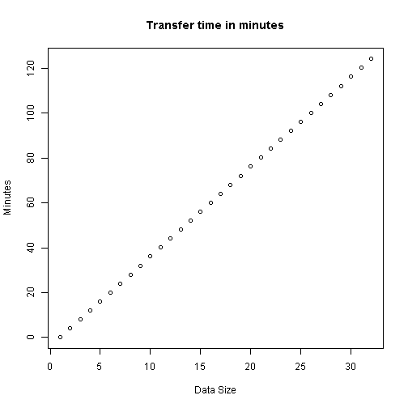
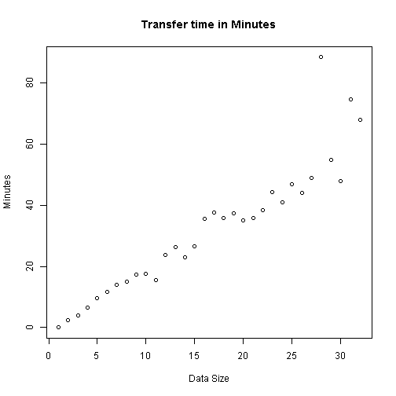

1- Presentation File transfer  Project
========================================================
author: Enzus
date: 20 October 2015

2-  Overview 
========================================================

On this project was created a simple but reliable application.
it calculates the time taken to transfer a file over the network.
Having the following information:
- Data Amount to be transferred;
- Transfer rate;
- The Data unit (MG,GB,TB).

The out put can be in three different time units

- Seconds
- Minutes 
- Hours


3- Formula Used  
========================================================
The following is the formula used.
Where the measure units are included for a quick conversation. 


$$Time\ For\ Transfer=  \frac{[Data]\cdot [Data Unit\ Measure] }{[Transfer\ Rate]\cdot [Time Unit]}$$

Below are the initialization values

```r
Data<-seq(1,2048,by=64)
tempMesure<-1
transfer<-16
temptime<-1
```


4-  Example-- transfer with constant time
========================================================


```r
value<-Data*tempMesure/transfer*temptime
plot(value,main="Transfer time in minutes",xlab="Data Size",ylab = "Minutes")
```

 

5-  Second Example -- Not  constant Transfer Rate
========================================================

```r
transfer<-rnorm(32,30,5)
value<-Data*tempMesure/transfer*temptime
plot(value,main="Transfer time in Minutes",xlab="Data Size",ylab = "Minutes")
```

 
